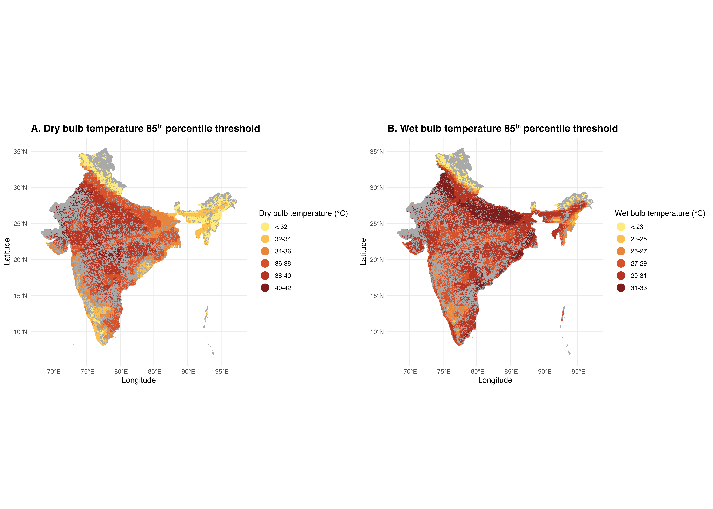
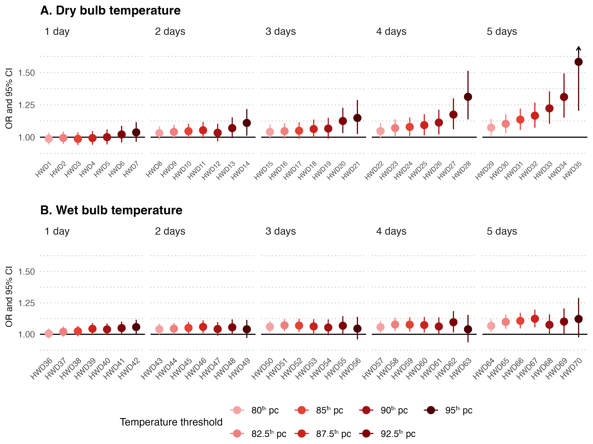
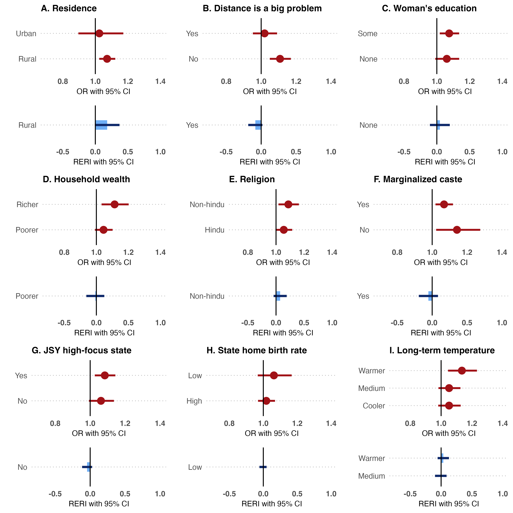

# Heatwaves and Home Births: Impact of Extreme Heat on Delivery Choices in India

This repository contains the scripts used to study the effect of extreme heat on home deliveries in India. The following sections describe the data sources used in the study and the scripts needed to replicate the analysis. 

# Data Sources
Raw data for Wet Bulb Globe Temperature (WBGT) and Dry Bulb temperatures can be obtained directly using the links below. Data on place of delivery, date of birth, and other individual level socio-economic and demographic variables can be obtained from the Demographic and Health Survey (DHS) website by creating an account and submitting an application to use the data.

* WBGT-Max: https://zenodo.org/records/8021197
* Dry-bulb temperature: https://psl.noaa.gov/data/gridded/data.cpc.globaltemp.html
* DHS dataset (https://www.dhsprogram.com/data/available-datasets.cfm)

# Results

## Spatial distribution of 85th percentile thresholds for WBGT and Dry-bulb maximum temperatures

## Odds Ratios and 95% CIs from the full models 

## Odds Ratios and RERI (95% CIs) from effect modification analysis 

